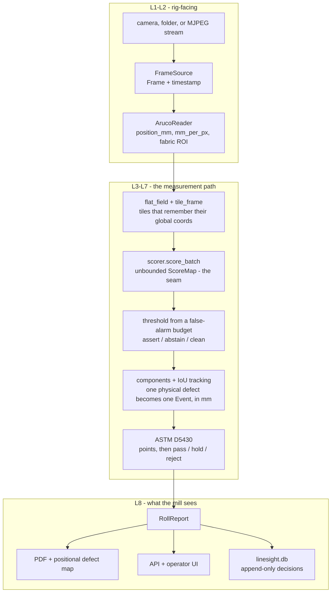

# LineSight

Cold-start visual inspection for textile rolls.

Fit a per-SKU normality profile from ~30 defect-free tiles in ~90 seconds, with
no training loop and no labelled defects. Derive the detection threshold from a
stated false-alarm budget rather than by hand. Report every defect in
millimetres and score the roll under ASTM D5430.


---

## Why

A mill onboards a new fabric construction every week. Supervised defect
segmentation needs a labelled corpus per construction, and that corpus does not
exist at the moment it is needed. So LineSight learns what *normal* looks like
from a handful of defect-free samples and flags everything else — including
defect types nobody labelled.

Three things are fitted from data: a frozen ImageNet ResNet, a per-SKU memory
bank, and a threshold from held-out clean fabric. It is **backprop-free, not
data-free** — the distinction matters, and "no training loop" invites the wrong
question.

## Quickstart

**Windows** — use `run.ps1`. There is no `make` on a stock Windows box, and
under WSL the Makefile's `$(HOME)` points at the Linux home rather than
`C:\Users\<you>` (a WSL shell cannot execute the Windows venv anyway).

```powershell
.\run.ps1 help          # every task, one line each
.\run.ps1 install       # creates the venv at ~\.venvs\linesight
.\run.ps1 test
.\run.ps1 tape          # print the ArUco position tape
.\run.ps1 check         # camera bring-up: fps, focus, exposure, tape
```

If PowerShell refuses to run the script at all, that is the execution policy,
not the script:

```powershell
Set-ExecutionPolicy -Scope Process -ExecutionPolicy Bypass
```

**Linux / macOS / CI** — the Makefile mirrors the same targets:

```bash
make install && make test
make fit && make calibrate && make report
```

### The bench rig, end to end

Print and fit the tape, point the phone at the cloth, then two commands with a
fabric swap between them.

```powershell
.\run.ps1 tape                       # results/position_tape.pdf -- print at 100%
.\run.ps1 align   --url <mjpeg>      # live view: the ROI and the tape drawn on it
.\run.ps1 learn   --url <mjpeg>      # watch clean cloth: bank + threshold
#   ... swap the clean cloth for the sheet under test ...
.\run.ps1 inspect --url <mjpeg>      # score it, write the roll report
```

`align` is the one to leave open while pulling: it draws the inspected region
and the marker tape, and turns red the moment the tape drifts into the region
being scored -- which is how a real run once produced thirteen detections that
were all markers.

### The commands underneath

```bash
python -m linesight fit       --sku aitex_02 --normal data/aitex/normal_02/
python -m linesight calibrate --sku aitex_02 --clean  data/aitex/clean_02/ --budget 1.0
python -m linesight run       --sku aitex_02 --source data/aitex/roll_02/
python -m linesight serve     --sku bench --source http://<phone>:8080/video
```

### Seeing it work on one image

```powershell
.\run.ps1 mark -Fabric 02 -N 3
```

Writes a four-panel PNG per image to `results/marked/` — input with the
ground-truth outline, raw heatmap, threshold mask, and the marked panel with mm
lengths and ASTM points. If that looks right, the chain works.

<details>
<summary><b>Why the venv is not in the repo</b></summary>

This repo sits ~90 characters deep, Windows caps paths at 260 by default, and
torch ships licence files with ~160-character relative paths. An in-repo
`.venv/` fails to install torch with `WinError 206`. Both `run.ps1` and the
Makefile therefore put it at `~/.venvs/linesight`.

Override with `make VENV=.venv install` on Linux/macOS, or enable long paths
system-wide (needs admin):

```powershell
Set-ItemProperty 'HKLM:\SYSTEM\CurrentControlSet\Control\FileSystem' LongPathsEnabled 1
```
</details>

## How it works

```
 L1 ACQUISITION      FrameSource -> BGR frame + timestamp
 L2 GEOMETRY         frame -> (position_mm, mm_per_px, fabric_roi)
 L3 PREPROCESS       fabric_roi -> List[Tile] with global coords
 L4 DETECTION        Tile -> ScoreMap (float32, unbounded)      <-- the seam
 L5 CALIBRATION      ScoreMap + threshold -> mask + confidence
 L6 EVENT ASSEMBLY   masks across tiles/frames -> List[Event] in mm
 L7 SCORING          Events -> ASTM D5430 points -> pass/hold/reject
 L8 PRODUCT          API, store, operator UI, PDF, defect map
```



Every arrow is a typed function, and `src/linesight/pipeline.py` is where they
are composed — the shortest route into the code. Full detail in
[docs/architecture.md](docs/architecture.md); every interface verbatim in
[docs/contracts.md](docs/contracts.md).

**The model** is PatchCore, written by hand (~250 lines, no Anomalib). Push
defect-free tiles through a frozen `resnet18`, take `layer2`+`layer3`, pool a 3×3
neighbourhood, project 384→128, keep a greedy k-center coreset. Score a new tile
by each patch's L2 distance to its nearest bank entry. No gradients, no epochs,
no hyperparameter search.

**The threshold** is not chosen. The operator states a false-alarm budget — say,
one false alarm per 100 metres — and the threshold is the corresponding empirical
quantile of scores on held-out clean fabric. In the one-sided case that *is* the
finite-sample conformal quantile.

```python
tiles_per_100m = 100.0 / metres_per_tile
allowed_frac   = budget_fa_per_100m / tiles_per_100m
k              = math.ceil((n + 1) * (1.0 - allowed_frac))   # an ORDER STATISTIC
threshold      = float(np.sort(clean_scores)[k - 1])
```

That `k` matters more than it looks. `np.quantile` *interpolates* between
neighbouring order statistics, which is the plug-in estimator and carries no
finite-sample guarantee — it lands below the true quantile about half the time.
Measured on the bench: the interpolated version turned a stated 1 FA/100 m into
a realised 4.9. The split-conformal construction above guarantees the exceedance
rate is at most `allowed_frac` for exchangeable data.

Scores between `abstain_low` and `threshold` are surfaced as **uncertain** and
contribute zero points until an operator confirms them.

Calibration **refuses** twice, rather than returning a number the sample cannot
support. Once when the order statistic does not exist at all, and again when
fewer than `stability_margin` samples sit above it — because a threshold resting
on the sample *maximum* still satisfies the guarantee marginally while varying
several-fold for the one calibration set you actually have. Clean fabric needed
scales as `stability_margin / allowed_frac`; the error message says how much.

## Results

> Six of the seven studies have now run in full; the coreset ablation is
> measured for greedy-vs-random but not for the full fraction sweep. Two results
> contradicted the specification they were meant to confirm, and are reported as
> they came out. See
> [docs/evaluation.md](docs/evaluation.md) for the method, the stated
> hypotheses, and the threats to validity.

| Study | Result |
|---|---|
| MVTec reproduction (image AUROC, shipped config) | carpet **0.9615** · leather **0.9840** · grid 0.5522 |
| AITEX cold start, 6 fabrics (tile / pixel AUROC) | **0.859** / **0.971** |
| AITEX cross-construction transfer (tile AUROC) | 0.629 — a **+0.230** in-distribution advantage |
| Ten Fabrics Dataset, 10 cold starts (block / image) | **0.914** / 0.761 mean over fabrics |
| False alarms against ground truth, Fabric Stain | 1,315–1,391 FP/100 m — see [results/](results/README.md) |
| Latency per processed frame (laptop CPU, stride 2) | median **478 ms** |
| Normal-set size at which AUROC flattens | **no knee by 100 tiles** — 30 captures 46% of the 5→100 gain |
| Supervised U-Net, in-distribution / held-out fabric | 0.773 / 0.628 tile AUROC — PatchCore beats it in **both** |
| Backbone ablation (tile AUROC, CPU ms/tile) | resnet18 0.859 @ 37 ms · wide_resnet50_2 **0.978** @ 176 ms |
| Calibration: realised / requested false-alarm rate | **0.98** over 45 resolvable cases; 18 refused as unresolvable |

## The seam

`detect/base.py` is the only thing the layers above and below L4 agree on:

```python
class AnomalyScorer(Protocol):
    def fit(self, normal_tiles: list[np.ndarray]) -> None: ...
    def score(self, tile: np.ndarray) -> np.ndarray: ...   # float32, unbounded
    def score_batch(self, tiles: list[np.ndarray]) -> list[np.ndarray]: ...
    def save(self, path: str) -> None: ...
    @classmethod
    def load(cls, path: str) -> "AnomalyScorer": ...
```

`StubScorer` implements it in numpy alone, so every other layer can be run and
tested — in CI, on a machine with no torch and no dataset — without the model.
The supervised U-Net baseline implements the *same* protocol, which makes
comparing the two a config change rather than a second pipeline.

## What it does not do

- **It does not classify defects.** Every detection is an `unclassified anomaly`.
  Classification needs labelled defects per construction — the thing that does
  not exist at onboarding, and the whole premise of the project (ADR-008).
- **It does not run on edge hardware yet.** Latency is measured on a laptop CPU
  and the extrapolation is stated as an extrapolation (ADR-009).
- **It does not hide its sampling.** Frame stride is published with every latency
  figure.
- **It does not pretend to know where it is when it doesn't.** A missed marker
  raises a gap warning rather than reporting the skipped fabric as clean.

Full framing on the last page of every generated report.

## Repository

```
configs/     default.yaml + one file per SKU; no magic numbers live in code
docs/        architecture, contracts, datasets, evaluation, ADR-001..011
probes/      standalone scripts that proved each feature before it entered src/
tools/       the rig: tape generator, alignment view, two-phase bench run
scripts/     fetch_data.sh -- local datasets only
src/linesight/   the eight layers; pipeline.py composes them
tests/       147 tests; none needs a dataset, none needs the model
```

**The probe → promote rule:** no code enters `src/` until a probe script proves
the feature standalone. Probes stay in the repo — they document how each piece
was validated. See [probes/README.md](probes/README.md).

## Decisions

Each ADR is context, decision, consequences — including the costs accepted.

| | |
|---|---|
| [ADR-001](docs/decisions/ADR-001-write-patchcore-ourselves.md) | Write PatchCore ourselves, not Anomalib |
| [ADR-002](docs/decisions/ADR-002-kaggle-is-evidence-local-is-product.md) | Kaggle is evidence; local is the product |
| [ADR-003](docs/decisions/ADR-003-mvtec-stays-on-kaggle.md) | MVTec stays on Kaggle; local dev on AITEX |
| [ADR-004](docs/decisions/ADR-004-supervised-baseline-as-the-losing-baseline.md) | Train a supervised U-Net as the losing baseline |
| [ADR-005](docs/decisions/ADR-005-aruco-markers.md) | ArUco markers on the position tape |
| [ADR-006](docs/decisions/ADR-006-file-first-stream-second.md) | File-first, stream-second |
| [ADR-007](docs/decisions/ADR-007-threshold-from-a-false-alarm-budget.md) | Threshold from a false-alarm budget |
| [ADR-008](docs/decisions/ADR-008-no-defect-classification.md) | No defect classification branch |
| [ADR-009](docs/decisions/ADR-009-no-jetson-measure-and-extrapolate.md) | No Jetson; measure and state the extrapolation |
| [ADR-010](docs/decisions/ADR-010-coreset-fraction-10-percent.md) | Keep 10% in the coreset, not the paper's 1% |
| [ADR-011](docs/decisions/ADR-011-brute-force-nearest-neighbour.md) | Brute-force NN search; no FAISS |

## Licensing

The code is MIT — see [LICENSE](LICENSE).

MVTec AD is CC BY-NC-SA 4.0 — **non-commercial**. It is used for validation only;
nothing derived from it ships; the deployed system fits on the mill's own fabric.
AITEX requires citing the AFID paper. Details in
[docs/datasets.md](docs/datasets.md).
