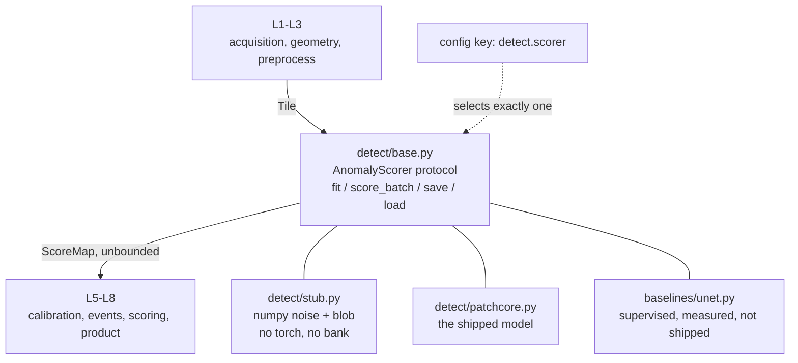
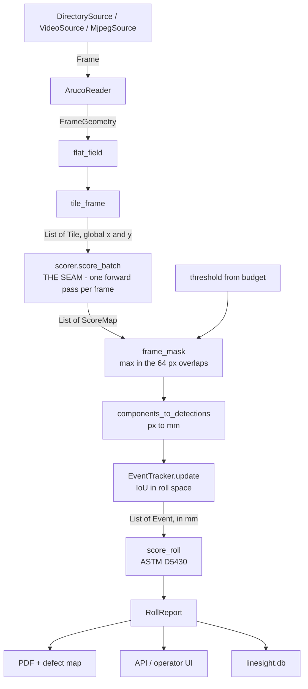
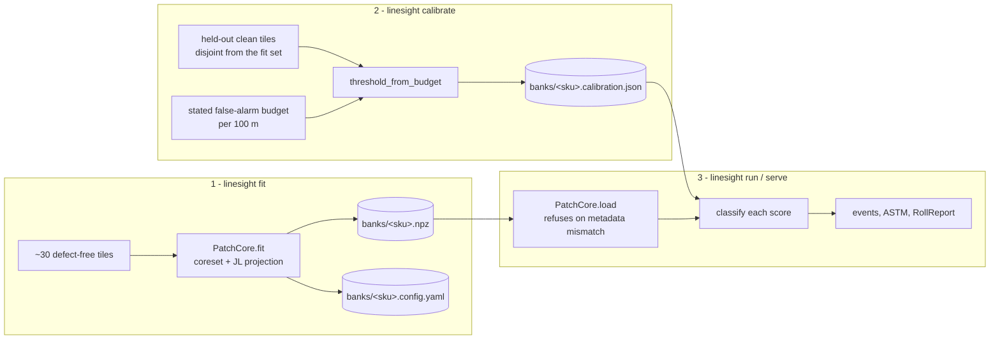
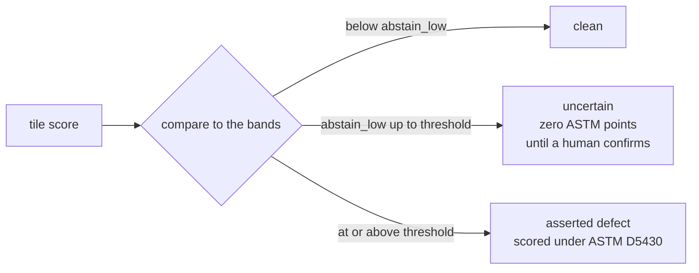

# Architecture

Eight layers. Every arrow is a typed function. That is the architecture argument.

```
 L1 ACQUISITION      FrameSource -> BGR frame + timestamp
 L2 GEOMETRY         frame -> (position_mm, mm_per_px, fabric_roi)
 L3 PREPROCESS       fabric_roi -> List[Tile] with global coords
 L4 DETECTION        Tile -> ScoreMap (float32, unbounded)      <-- the seam
 L5 CALIBRATION      ScoreMap + threshold -> mask + confidence
 L6 EVENT ASSEMBLY   masks across tiles/frames -> List[Event] in mm
 L7 SCORING          Events -> ASTM D5430 points -> pass/hold/reject
 L8 PRODUCT          API, store, operator UI, PDF, defect map
```

L1–L2 are the rig-facing half (a camera and a printed tape); L3–L7 are the
measurement path; L8 is everything a mill sees. Each layer is a package under
`src/linesight/`, and `pipeline.py` is where they are composed.

## Layer responsibilities

| Layer | Module | Owns | Must not |
|---|---|---|---|
| L1 | `acquisition/` | Turning a folder, a video, or a phone stream into `Frame` objects with monotonic indices and timestamps. Applying the frame stride. | Know anything about fabric, defects, or geometry. |
| L2 | `geometry/` | Decoding ArUco markers into an absolute `along_mm` and a measured `mm_per_px`; cropping the fabric ROI away from the marker tape; raising a gap warning when position cannot be vouched for. | Touch pixels for any purpose other than measurement. |
| L3 | `preprocess/` | Flat-field correction; cutting the ROI into overlapping tiles that remember their global coordinates. | Resize for the backbone — that belongs to L4, which owns its own input size. |
| L4 | `detect/` | Turning one tile into an unbounded per-pixel anomaly score. | Threshold, normalise, or know what a defect is. |
| L5 | `calibrate/` | Deriving a threshold from a stated false-alarm budget on held-out clean fabric; splitting scores into asserted / uncertain / clean. | Be tuned by hand, ever. |
| L6 | `events/` | Connected components per frame in millimetres; IoU tracking across frames so one physical defect is one `Event`. | Know how points are awarded. |
| L7 | `scoring/` | ASTM D5430 points, the per-metre cap, points per 100 yd², the verdict. | Import numpy, cv2, or torch. It is arithmetic. |
| L8 | `api/`, `report/` | Persistence, the operator UI, the PDF, the defect map, the live false-alarm counter. | Contain any inspection logic. |

`pipeline.py` composes them and owns no algorithm of its own. If logic appears
there, it has been put in the wrong place.

## Why the boundaries are where they are

**L4/L5 is the load-bearing one.** Detection returns unbounded scores and
calibration turns them into decisions. Keeping them apart is what makes a single
`threshold_from_budget` work identically for PatchCore and for the supervised
U-Net baseline — which is what makes the comparison in `evaluation.md` a two-line
swap rather than a second pipeline. It is also what stops a threshold from being
quietly hard-coded inside a model where nobody would find it.

**L6/L7 matters for correctness, not tidiness.** ASTM scores a defect by its
length. Eight untracked 40 mm fragments of one warp line score 8 points; the one
tracked 320 mm defect they actually are scores 4 points per metre. Running
without tracking is therefore a real, selectable class (`PerFrameTracker`) with
the same interface, and its cost — over-counted, under-measured long defects —
is stated in the report rather than left for a reader to find.

**L7 is dependency-free on purpose.** `scoring/astm_d5430.py` is pure functions
from numbers to numbers, and `tests/test_skeleton.py` asserts it imports neither
numpy nor cv2 nor torch. That is what makes the arithmetic behind a verdict
checkable by hand, and its golden tests independent of everything upstream.

## The seam

`detect/base.py` is the only thing the layers above and below L4 agree on, and
it is reproduced verbatim in [contracts.md](contracts.md). Three
implementations, all selected by the same config key `detect.scorer`:

- `detect/stub.py` — noise plus a bright blob, numpy only. Lets every other
  layer be run and tested with no model, no bank and no torch.
- `detect/patchcore.py` — the shipped model.
- `baselines/unet.py` — the supervised baseline, same protocol, measured and
  not shipped.



Because the seam is narrow, replacing the detector touches one config key and
nothing else in the eight layers.

## Data flow, concretely



The batching arrow is the one performance decision that matters: all tiles of a
frame go through the backbone together. On CPU that is the difference between
keeping up with the fabric and falling behind it, which is why `score_batch` is
part of the protocol rather than a convenience.

## The three lifecycles

Fit, calibrate and inspect are separate commands that meet only through files in
`banks/`. Nothing is held in memory between them, which is what lets a bank be
fitted on one machine and used on another.



The config snapshot written beside the bank is provenance, not an input: it
records the exact configuration a bank was fitted under, so `PatchCore.load` can
refuse a bank whose backbone, input size, layers or projection dim no longer
match the running config.

The classification step is three-way, and the middle band is the one that keeps
the report honest:



## Artifacts

| Artifact | Path | Size | Contents |
|---|---|---|---|
| Memory bank | `banks/{sku}.npz` | ~600 KB | `bank` (1200×128 f32), `projection` (384×128), `backbone_name`, `input_size`, `layers`, `fit_timestamp`, `n_normal_tiles` |
| Resolved config | beside each run | ~2 KB | The exact configuration that produced the result |
| Roll store | `linesight.db` | small | rolls, events, and an append-only decision audit |
| Evidence crops | `results/evidence/` | varies | One heatmap-overlaid crop per event |

The deployable artifact of this system is a 600 KB `.npz` fitted in ~90 seconds,
not a checkpoint. That is the product argument, and it is why the artifact format
is documented here rather than left implicit.

## Failure modes, by design

| Condition | Behaviour |
|---|---|
| No marker decoded, gap within `max_gap_mm` | Position extrapolated, frame marked `interpolated` |
| Gap beyond `max_gap_mm` | `gap_warning` set; counted in the roll report and shown in the UI |
| Score in the abstain band | Surfaced as `uncertain`; contributes **zero** ASTM points until confirmed |
| Too few clean tiles for the budget | `threshold_from_budget` raises, and the achievable resolution is displayed |
| Bank metadata mismatches the config | `PatchCore.load` refuses rather than producing plausible nonsense |
| Frame file unreadable | `DirectorySource` raises — a skipped frame is uninspected fabric |

A system that silently reports uninspected fabric as clean is worse than one
that admits it lost track.
